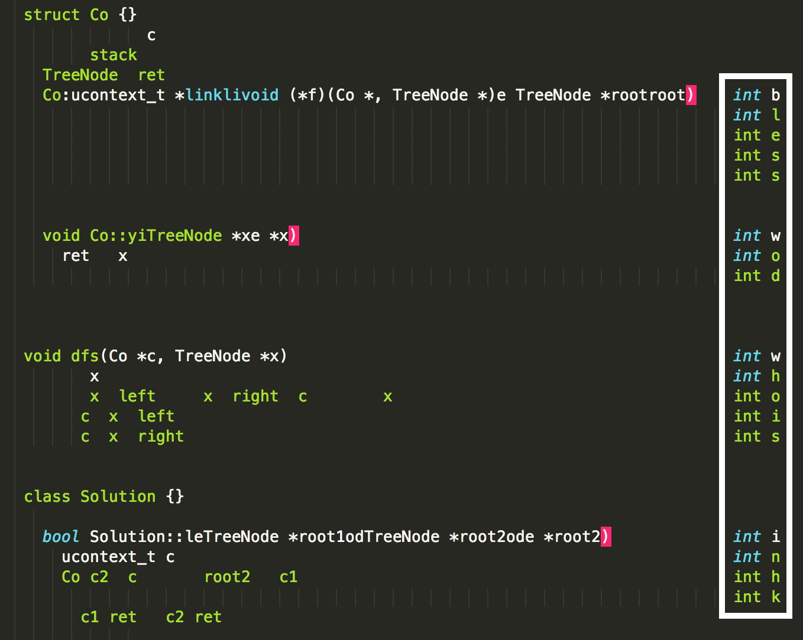

# CCLS-FRINGE

### Challenge Description


Ray said that the challenge "Leaf-Similar Trees" from last LeetCode Weekly was really same-fringe problem and wrote it in the form of coroutine which he learned from a Stanford friend. Can you decrypt the cache file dumped from a language server without reading the source code? The flag is not in the form of rwctf{} because special characters cannot be used. 

Downloads: [ccls-fringe.tar.xz](cache.json)

### Solution

###### Reading the binary

This challenge provided a binary cache file generated by [ccls](https://github.com/MaskRay/ccls). 

To get something human-readable out of the cache file, we cloned the ccls repo and made a few hacky fixes to "re-dump" the cache file in JSON format: we found that the `RawCacheLoad` function can (basically) read a cache file and we can use `ToString` to re-serialize the file in JSON. We had to make some additional changes to make sure everything compiles. For more details, check the diff file. 

We formatted the json output and got [cache.json](cache.json).

###### Reconstructing the source

At this point we assumed we had to reconstuct the source to get the flag. 

We notice that the json had a lot of entries like 

```json

	  {
         "usr":276205476276871220,
         "detailed_name":"std::ucontext_t *link",
         "qual_name_offset":17,
         "short_name_offset":17,
         "short_name_size":4,
         "hover":"",
         "comments":"",
         "declarations":[

         ],
         "spell":"16:18-16:22|1935187987660993811|3|514",
         "extent":"16:6-16:22|1935187987660993811|3|0",
         "type":10680981372214796225,
         "uses":[

         ],
         "kind":253,
         "storage":0
      },  
```

We assume that:

- the first part of the `spell` attribute(`16:18-16:22`) indicates that on line 16 of the source file, the 18th character to the 22nd character is the shortname, `link`.

- similarily, the `extent` attribute indicates that on line 16 of the source file, the 6th character to the 22nd character is the detailed name. However in this case, the length doesn't match, so they probably used `using namespace std; ` and omitted the `std::` part. 

After we generated some of the source, we noticed that there are a few varibles that are written in weird locations. 



Also, there is a `flag is here` comment with the statement `int b` in the cache json. So the final flag is `blesswodwhoisinhk`. 


